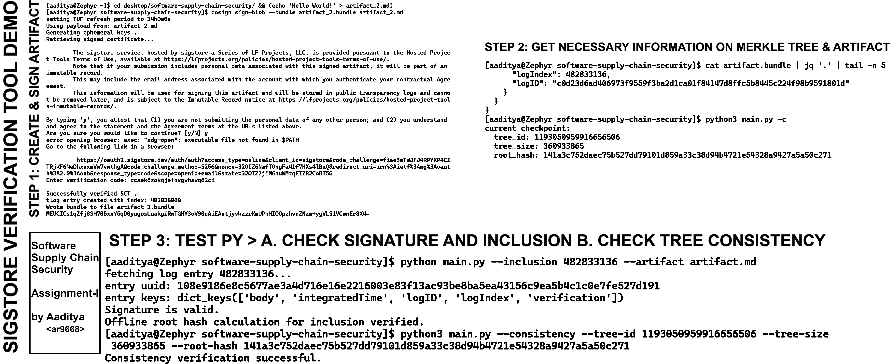

# software-supply-chain-security

[](https://github.com/rogue0xbyte/assignment-1-sscs/actions/workflows/cd.yaml)
[](https://github.com/rogue0xbyte/assignment-1-sscs/actions/workflows/ci.yaml)
[](https://scorecard.dev/viewer/?uri=github.com/rogue0xbyte/assignment-1-sscs)
[](https://www.bestpractices.dev/projects/11542)

this repository demonstrates software supply chain security practices using [sigstore](https://www.sigstore.dev/) for artifact signing and verification.  
it includes steps to **create, sign, and verify software artifacts**, along with verifying their inclusion in a **merkle tree transparency log**.

the workflow implemented here helps ensure:
- integrity of published artifacts
- provenance tracking of software releases
- prevention of supply chain attacks

---

## repository structure

| file / folder       | description |
|---------------------|-------------|
| `artifact.md`       | initial sample artifact file to sign |
| `artifact.bundle`   | signed bundle generated by sigstore for `artifact.md` |
| `artifact_2.md`     | second sample artifact |
| `artifact_2.bundle` | signed bundle for `artifact_2.md` |
| `main.py`           | core verification script (inclusion & consistency checks) |
| `merkle_proof.py`   | utilities for working with merkle tree proofs |
| `util.py`           | helper functions used across scripts |
| `demo.png`          | visual demo of signing and verification steps |
| `__pycache__/`      | compiled python cache files |
| `.gitignore`        | ignored files for git |

---

## demo workflow

the overall process is divided into **three steps**:

### step 1: create & sign artifact
generate an artifact and sign it with sigstore:
```bash
echo "hello world!" > artifact_2.md
python -m sigstore sign --bundle artifact_2.bundle artifact_2.md
````

this generates:

* the signed bundle `artifact_2.bundle`
* transparency log entry metadata (e.g., `logIndex`, `logID`)

---

### step 2: get merkle tree & artifact info

extract important fields from the bundle:

```bash
cat artifact_2.bundle | jq '.' | tail -n 5
```

example output:

```
"logIndex": 482833136,
"logID": "c0d23d6ad406973f9559f3ba2d1ca01f84147d8ffc5b8445c224f98b9591801d"
```

check the current checkpoint of the merkle tree:

```bash
python3 main.py -c
```

---

### step 3: verify artifact

#### a) verify signature & inclusion

```bash
python main.py --inclusion 482833136 --artifact artifact_2.md
```

output will confirm:

* signature validity
* offline root hash calculation
* inclusion proof verification

#### b) verify tree consistency

```bash
python3 main.py --consistency \
  --tree-id 1193050959916656506 \
  --tree-size 360933865 \
  --root-hash 141a3c752daec75b527dd79101d859a33c38d94b4721e54328a9427a5a50c271
```

---

## demo screenshot



---

## prerequisites

* python 3.8+
* `sigstore` cli tool
* `jq` for json parsing
* `pip install -r requirements.txt` (if present)

---

## use case

this setup is ideal for:

* securing ci/cd pipelines
* ensuring integrity of open-source releases
* validating provenance of dependencies

---

## author

**aaditya rengarajan `<ar9668>`**
assignment for **software supply chain security**

---

## [to-do]


[] review test-cases written with ai-assistance
